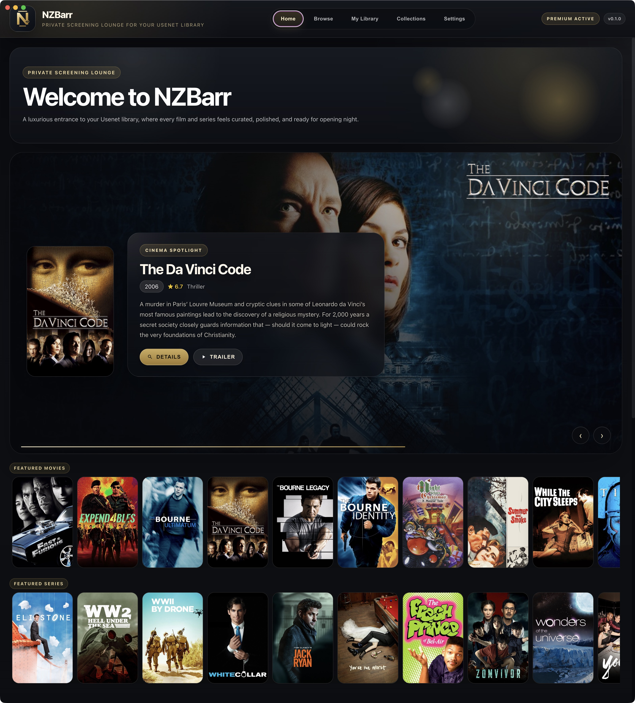
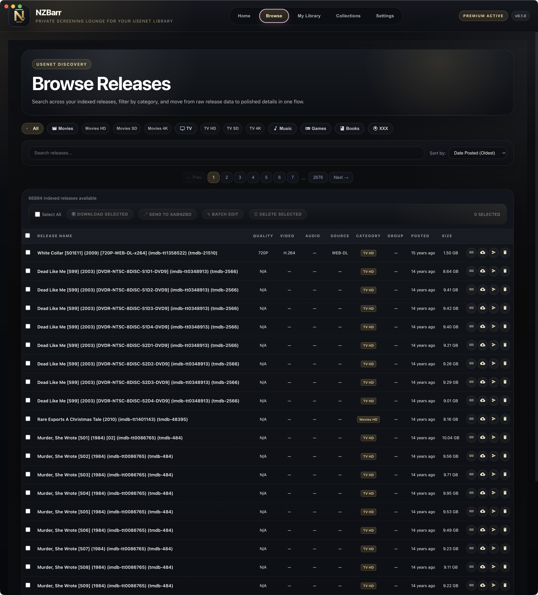
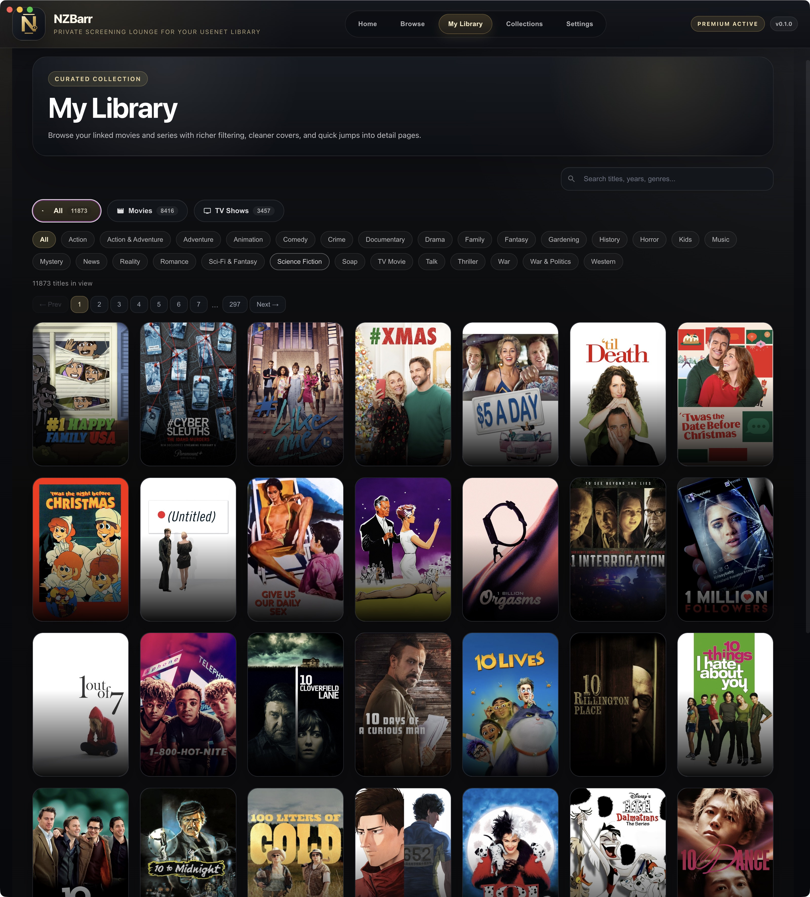
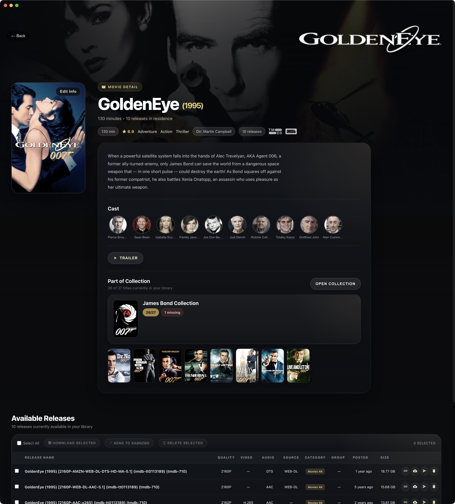
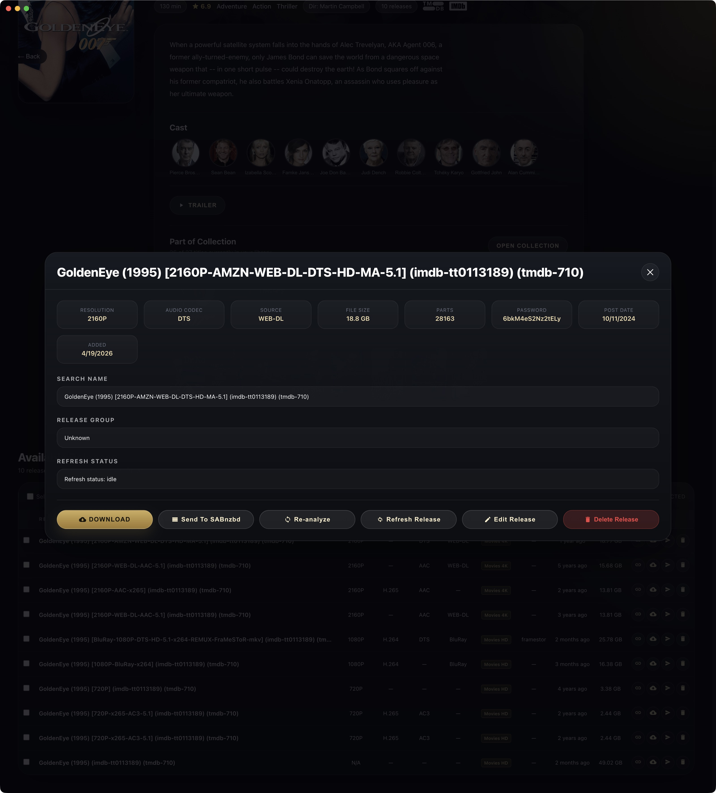
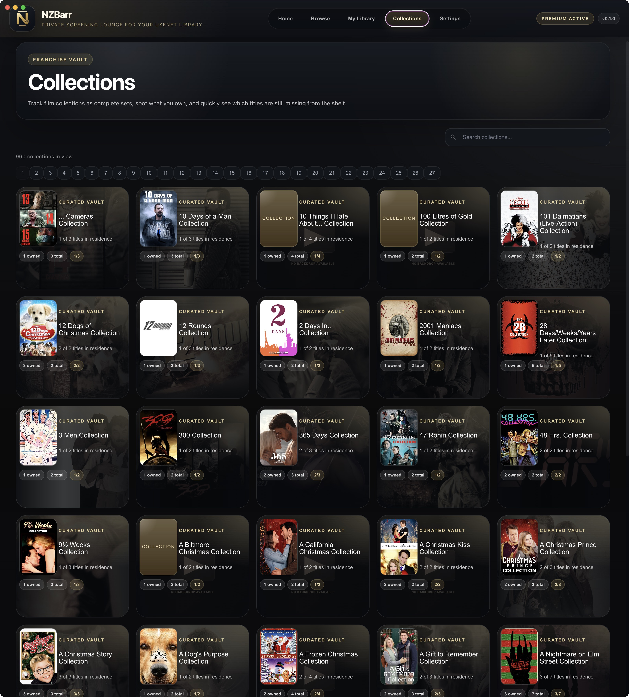
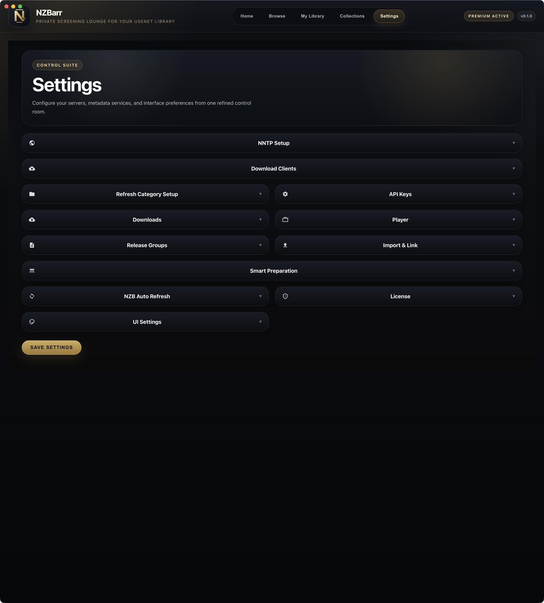

## NZBarr

<p align="center">
  
</p>

NZBarr is a desktop library for NZB files. It lets you keep a local media library made from NZBs, enrich it with movie and TV metadata, and send items to a downloader when you want to use them.

NZBarr does not include media, Usenet access, indexer access, or downloader software. You need your own Usenet provider, NZB files, and optional downloader setup.

## What NZBarr Can Do

- Import `.nzb` and `.nzb.gz` files into a local SQLite library.
- Organize NZBs as movies, TV episodes, complete TV seasons, or other releases.
- Match movies and TV shows with TMDB and IMDb IDs.
- Download and cache artwork such as posters, backdrops, and logos.
- Browse, search, and group your NZB library.
- Link NZBs manually to a movie or TV show when automatic matching is not enough.
- Send NZBs to SABnzbd or NZBGet.
- Import direct stream URLs into the stream library.
- Use external players such as VLC, IINA, or MPV when configured.
- Run a refresh/repost workflow with SABnzbd and ngPost when those external tools are installed and configured.


## Best NZB Import Workflow

The recommended workflow is:

1. Put new NZB files in preparation folders.
2. Run Smart Preparation from Settings.
3. Let NZBarr rename the files into a clean pattern.
4. Use `Prepare + Import` to import the prepared files into your library.

Smart Preparation is important because raw NZB filenames are often messy. A filename can contain scene tags, provider tags, missing years, missing IMDb IDs, or unclear TV season data. Smart Preparation tries to normalize that before import, which gives NZBarr a much better chance of matching the right movie or TV show.

## Documentation

- [Getting Started](docs/getting-started.md): install from source, configure the basics, and import your first NZBs.
- [Settings Guide](docs/settings.md): explains each section of the Settings page.

## Screenshots And Artwork

Some documentation screenshots may show movie and TV metadata or artwork. NZBarr does not include TMDB artwork or a TMDB API key; artwork is loaded only when a user enters their own TMDB API key. This project is not endorsed, certified, or otherwise approved by TMDB.

## Screenshots

### Home



The home page gives a visual overview of the library, including highlighted titles, recent items, and quick entry points into the rest of the app.

### Browse



The browse page lists imported NZB releases with search, sorting, filtering, and release metadata for day-to-day library management.

### Library



The library page groups imported releases by movie or show, so multiple NZB versions can be managed under one media entry.

### Movie Details



The movie detail page shows metadata, artwork, cast information, and all available NZB releases linked to that title.

### Release Details



The release detail view shows technical release information, NFO and MediaInfo details, refresh status, and download actions.

### Collections



Collections group related movies together and make it easier to see which titles are already in the library and which are missing.

### Settings



The settings page is where users configure API keys, downloader connections, Smart Preparation folders, playback, and advanced refresh options.

## Smart Preparation

Open `Settings > Import & Link > Smart Preparation`.

Set one or both folders:

- `Movies Preparation Folder`: folder containing movie NZBs.
- `TV Preparation Folder`: folder containing TV episode or TV season NZBs.

Then use one of the buttons:

- `Prepare Folders`: scans the configured folders and renames NZB files into the NZBarr filename pattern.
- `Prepare + Import`: prepares the filenames and then imports the prepared NZBs into the NZBarr library.

For best results, also configure a TMDB API key in `Settings > API Keys`. Without a TMDB key, Smart Preparation can still parse filenames, but matching and metadata are more limited.

After `Prepare + Import`, successfully imported files are moved into a `.nzbarr-imported` folder inside the preparation folder. Duplicate imports are moved into `duplicates`. Movie files that need an IMDb ID can be moved into `needs-imdb`.

## Drag And Drop Import

Drag and drop import is available, but it should be used carefully.

Use drag and drop only when the NZB filenames are already prepared and follow the NZBarr filename pattern. If the filename is messy, incomplete, or missing important identifiers, use Smart Preparation first.

In short:

- Use `Smart Preparation` for normal importing.
- Use `Prepare + Import` when you want the safest one-step workflow.
- Use drag and drop only for files that already have clean names.

## Filename Pattern

NZBarr works best when filenames contain the title, year, technical metadata, and IMDb/TMDB IDs.

Movie example:

```text
Movie Title (2024) [2160P-WEB-DL-DTS-HD-MA-H.265-GROUP-mkv] [imdb-tt1234567] [tmdb-12345].nzb
```

TV episode example:

```text
Show Title [S01E02] (2024) [1080P-WEB-DL-DD5.1-H.264-GROUP-mkv] [imdb-tt1234567] [tmdb-12345].nzb
```

Complete TV season example:

```text
Show Title [S01] (2024) [1080P-WEB-DL-DD5.1-H.264-GROUP-mkv] [imdb-tt1234567] [tmdb-12345].nzb
```

Complete SPECIALS TV Series example:

```text
Show Title [S00] (2024) [1080P-WEB-DL-DD5.1-H.264-GROUP-mkv] [imdb-tt1234567] [tmdb-12345].nzb
```

Complete TV Series example:

```text
Show Title [S99] (2024) [1080P-WEB-DL-DD5.1-H.264-GROUP-mkv] [imdb-tt1234567] [tmdb-12345].nzb
```

Recommended parts:

- Title first.
- Year in parentheses, for example `(2024)`.
- TV season or episode in brackets, for example `[S01]` or `[S01E02]` or `[S00E01]` for specials or `[S99]` for complete series.
- Technical metadata in one bracket, for example `[1080P-WEB-DL-DD5.1-H.264-GROUP-mkv]`.
- IMDb ID, for example `[imdb-tt1234567]`.
- TMDB ID, for example `[tmdb-12345]`.

The IDs are strongly recommended. Titles can be ambiguous, remakes can share the same name, and TV shows can have regional title differences. IMDb and TMDB IDs make matching much more reliable.

## Running From Source

Install Node.js 18 or newer, then install dependencies:

```bash
npm install
```

Start the Git version:

```bash
bash start.sh
```

You can also run:

```bash
npm start
```

This checkout starts as `NZBarr-GIT` and uses a separate app data folder from the normal `NZBarr` app.

Common app data locations:

```text
macOS:   ~/Library/Application Support/NZBarr-GIT
Windows: %APPDATA%\NZBarr-GIT
Linux:   ~/.config/NZBarr-GIT
```

The exact location can vary depending on how Electron is packaged on a platform, but the important point is that `NZBarr-GIT` is kept separate from an existing `NZBarr` install.

## Building

```bash
npm run build        # all configured platforms
npm run build:mac    # macOS
npm run build:win    # Windows
npm run build:linux  # Linux
```

Builds from this checkout use the product name `NZBarr-GIT`.

## External Software

Basic library import and browsing work inside NZBarr. Some features need external software.

Optional downloaders:

- SABnzbd
- NZBGet

Refresh/repost workflow:

- SABnzbd
- ngPost
- MediaInfo
- unrar
- 7z

Optional external playback:

- VLC
- IINA
- MPV

If one of these tools is missing, only the related feature should fail. The rest of NZBarr can still be used.

Paths for external tools and folders are platform-specific. For example, a download folder might look like `/Users/name/Downloads` on macOS, `C:\Users\name\Downloads` on Windows, or `/home/name/Downloads` on Linux. Use paths as they exist on the computer running NZBarr.

## Project Structure

```text
NZBarr-GIT/
├── main-process/      Electron main process and preload bridge
├── renderer/          Frontend UI
├── src/               App services, repositories, and import logic
├── resources/         Icons and app resources
├── scripts/           Build and maintenance scripts
└── docs/              Extra technical documentation
```

## 💛 Support NZBarr

If you find **NZBarr** useful, consider supporting its development.  
Your contribution helps cover hosting, energy costs, and ongoing improvements.

<p align="center">
  <a href="https://nzbarr.com">
    <br/>
    
  </a>
</p>

## License

NZBarr is free and open source software licensed under GPL-3.0-or-later. See [LICENSE](LICENSE).

GPL means you can use, study, change, and share the code, but redistributed versions must also follow the GPL license terms.
